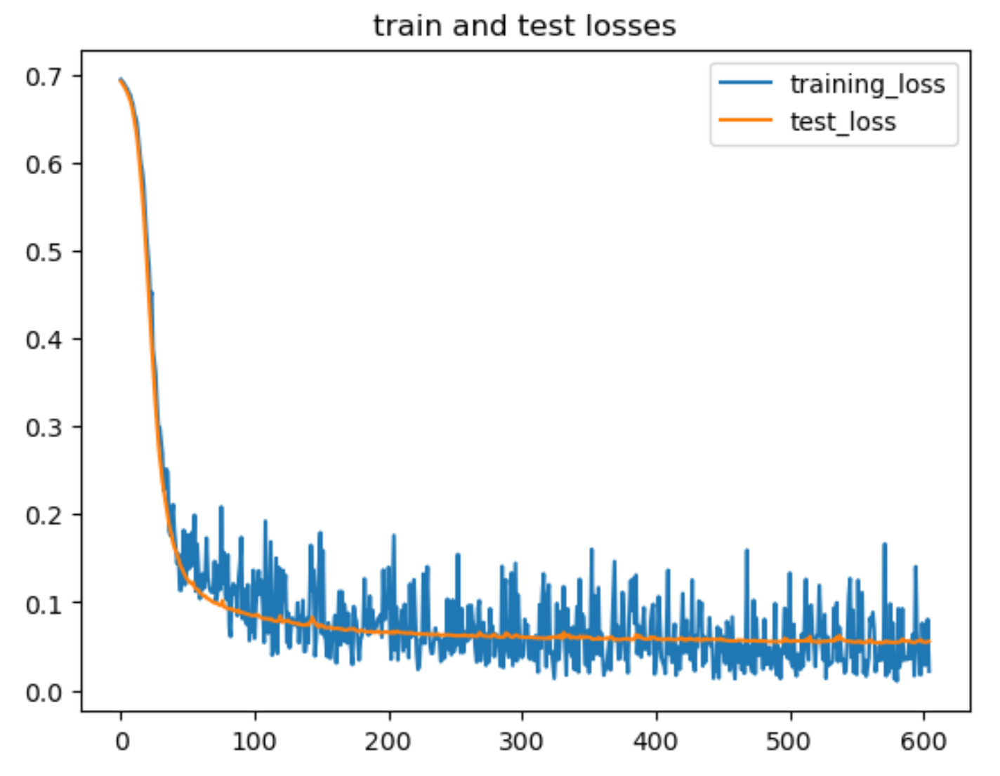
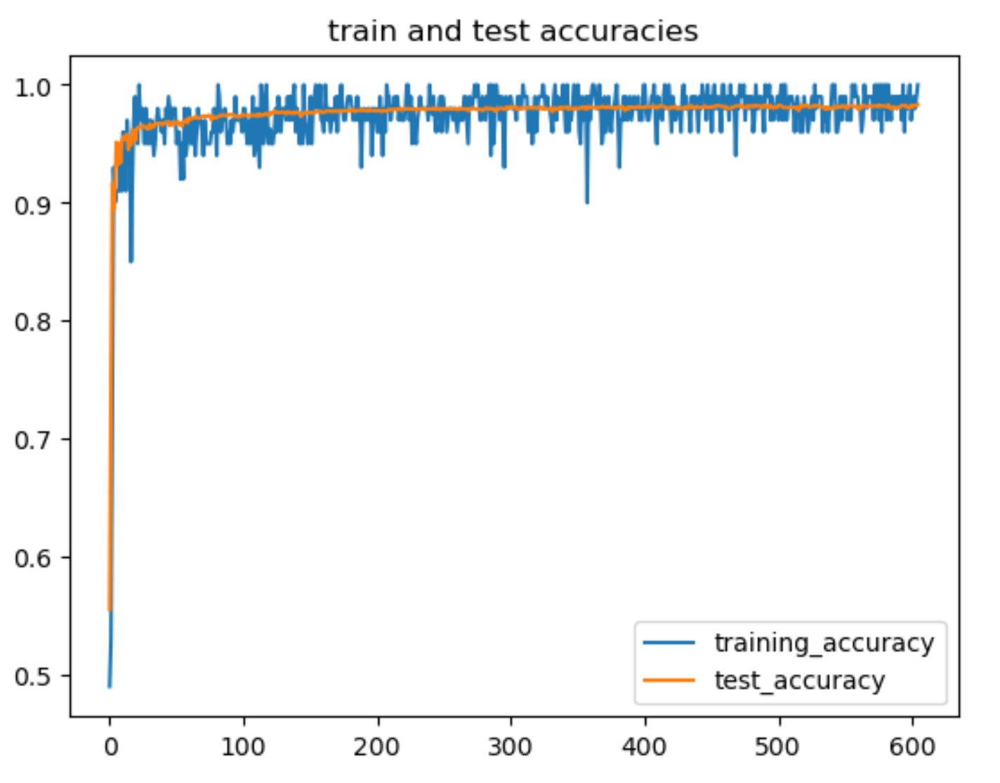

# Implementing a neural network in NumPy
The code is in "hw2.ipynb" and project requirement is in "hw2.pdf". \
In this project, I implement every part of a neural network in NumPy, which includes: 
1. The sigmoid and ReLU activation function;
2. The logistic loss;
3. The forward pass by iterayively doing matrix multiplication and non-linear activation, 
4. The backward pass by computing the gradients of each of the weight matrices and bias vectors;
5. Weight updates using SGD.

I train the neural network on the MNIST dataset and achieve the test accuracy of 0.98.
</img>
</img>
